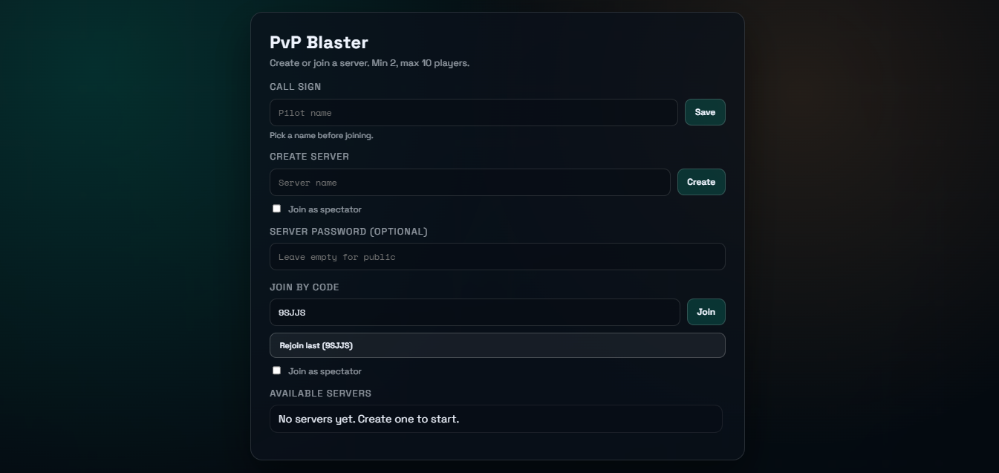
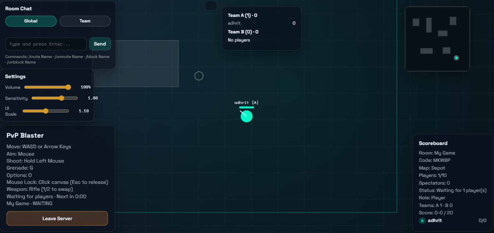
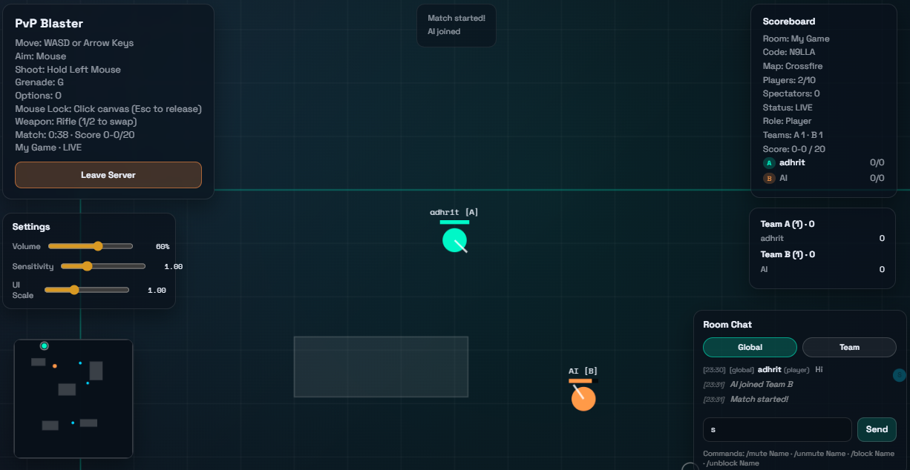

# PvP Blaster

Real-time multiplayer PvP shooter with lobbies, teams, spectators, chat, powerups, grenades, minimap, map voting, and mobile controls.

## Run The Game

1. Install dependencies:

```bash
npm install
```

2. Start the server:

```bash
npm start
```

3. Open the game in a browser:

```
http://localhost:3000
```

To host on a different port:

```bash
# Windows PowerShell
$env:PORT=3001; npm start
```

## How To Play

### Lobby
- Enter a **Call Sign** and click **Save**.
- **Create** a server or **Join** an existing one.
- **Join by Code** using the server code.
- You can join as a **Spectator** (cannot shoot/kill).
- Each server supports **2–10 players**.

### Desktop Controls
- Move: `WASD` or Arrow Keys  
- Aim: Mouse  
- Shoot: Hold Left Mouse  
- Grenade: `G`  
- Swap Weapon: `1` / `2`  
- Mouse Lock: Click the canvas (`Esc` to release)  
- Toggle Settings: `O`  
- Spectator: `[`, `]` or `/` to cycle players; `F` for free cam  
- Chat: Type and press `Enter`

### Mobile / Tablet Controls
- **Auto-detected** (mouse lock is disabled)
- Left joystick: Move  
- Drag on the canvas: Aim  
- `FIRE` button: Shoot  
- `GREN` button: Grenade  
- Spectator: Use **Prev / Next** buttons

### UI Tips
- All in‑game panels are **draggable** (lobby UI stays fixed).
- Use `O` to hide/show the Settings panel.

### Chat Commands
- `/mute Name`
- `/unmute Name`
- `/block Name`
- `/unblock Name`

### Map Vote (Between Rounds)
After each match ends, a **Map Vote** panel appears with 3 options.  
Players vote for the next map. When the timer ends, the server picks the map with the most votes (ties are random).

## How It Works

- **Server:** Node.js + Express + Socket.IO (`server.js`)
- **Realtime Loop:** Server ticks at 60 FPS and sends state snapshots 20 times per second.
- **Rooms:** Each server is a room with a unique code, max 10 players, min 2 to start a match.
- **Teams:** Players are auto-balanced into Team A / Team B. Friendly fire is disabled.
- **Spectators:** Can watch and cycle players; no shooting or damage.
- **Combat:** Hits are server-authoritative. Weapons, grenades, and powerups are validated by the server.
- **Map Rotation:** After each match, a map vote decides the next arena.

## Project Structure

- `server.js` — Multiplayer server and game rules
- `public/index.html` — UI and layout
- `public/style.css` — Styling
- `public/client.js` — Client input, rendering, UI

## Screenshots / Gameplay

screenshots of the Game:





## Troubleshooting

- **Server closes immediately:** Check for errors after `npm start`.
- **Port already in use:** Use another port:
  - PowerShell: `$env:PORT=3001; npm start`
- **No players / stuck waiting:** A match starts only when at least 2 players are in the same room.
